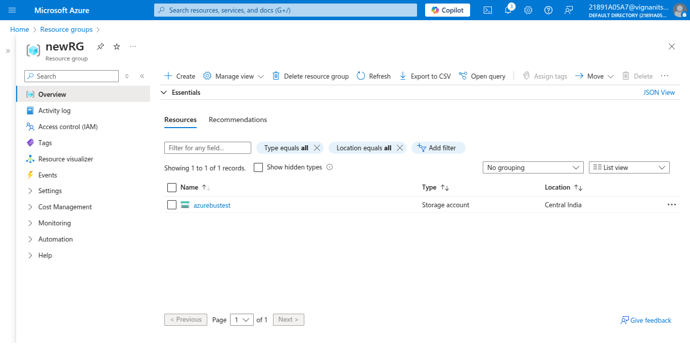
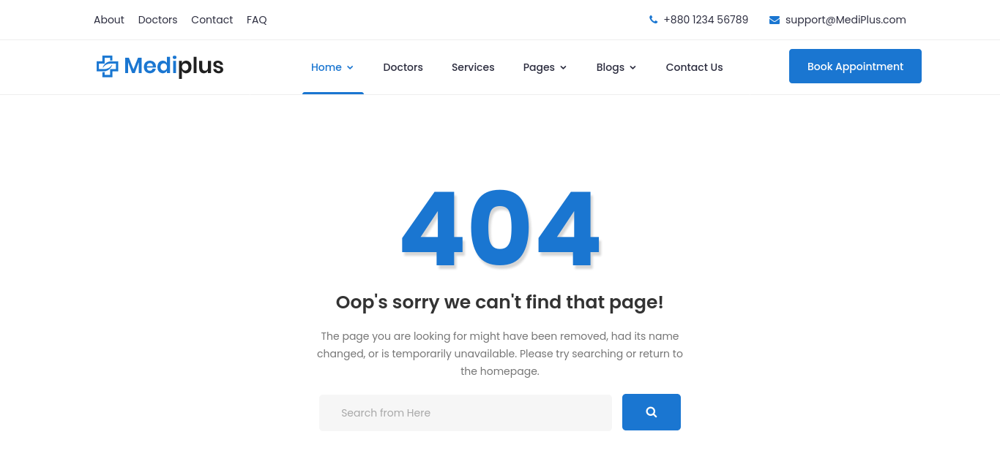

# Azure Load Balancer Implementation Using ARM Templates

## Project Overview

This project demonstrates the deployment of a highly available web application infrastructure using Azure Resource Manager (ARM) templates and Azure Load Balancer. The implementation showcases industry best practices for distributing web traffic across multiple virtual machines in different availability zones to ensure optimal performance, scalability, and fault tolerance.

**MediPlus**, a healthcare services website, serves as the demonstration application for this infrastructure deployment. The website provides users with information about healthcare services and demonstrates how static web content can be effectively served through a load-balanced architecture on Azure Cloud.

## Technical Objectives

This project illustrates the complete implementation of a production-ready web hosting solution that addresses critical infrastructure requirements including high availability, automatic failover, and scalable traffic distribution. The deployment demonstrates how ARM templates can be leveraged to create consistent, repeatable infrastructure deployments while maintaining configuration management and version control best practices.

## Architecture Overview

The solution implements a multi-tier architecture with the following components:

**Network Layer**: A Virtual Network (VNet) with strategically segmented subnets provides the foundation for secure communication between resources while maintaining proper network isolation and security boundaries.

**Compute Layer**: Two Virtual Machines deployed across different availability zones ensure geographic distribution and eliminate single points of failure. Each VM hosts the web application using Nginx web server for optimal performance and reliability.

**Load Balancing Layer**: Azure Load Balancer distributes incoming HTTP requests across healthy backend instances using configurable algorithms, with integrated health probes ensuring traffic is routed only to operational servers.

**Security Layer**: Network Security Groups (NSGs) implement granular access controls, permitting only necessary traffic on specified ports while maintaining comprehensive security posture.

## Azure Services Implementation

The deployment utilizes the following Azure services and tools:

**Azure CLI** provides command-line interface capabilities for resource group creation and initial environment setup, enabling scriptable and repeatable deployment processes.

**Azure Resource Manager (ARM) Templates** implement Infrastructure-as-Code principles, ensuring consistent resource deployment while maintaining version control and change management capabilities.

**Azure Virtual Network** establishes secure network infrastructure with proper subnetting and routing configuration to support multi-tier application architecture.

**Azure Virtual Machines** provide the compute resources necessary for hosting the web application, with automated configuration through custom script extensions.

**Azure Load Balancer** implements traffic distribution algorithms and health monitoring to ensure optimal performance and availability across backend instances.

**Network Security Groups** enforce security policies at the network level, controlling inbound and outbound traffic flows according to organizational security requirements.

## Deployment Process

### Infrastructure Provisioning

The deployment begins with the creation of a resource group using Azure CLI, establishing the logical container for all project resources. This approach ensures proper resource organization and facilitates management operations throughout the project lifecycle.

Virtual Network configuration follows with the deployment of ARM templates that establish the network foundation, including subnet configuration and Network Security Group assignment. The network design implements security best practices while providing the necessary connectivity for application components.

### Virtual Machine Configuration

Two Virtual Machines are deployed across different availability zones to ensure geographic distribution and fault tolerance. Each VM receives identical configuration through custom script extensions that automate the installation of required software packages and application deployment.

The custom script extension performs the following operations:

```bash
#!/bin/bash
sudo apt update
sudo apt install nginx git -y
cd /tmp && git clone https://github.com/typicalcoder047/azuremagicbusproject.git
sudo rm -rf /var/www/html/index.nginx-debian.html
sudo cp -r /tmp/mysite/* /var/www/html/
```

This automation ensures consistent configuration across all instances while eliminating manual configuration errors and reducing deployment time.

### Load Balancer Implementation

The Load Balancer configuration implements several critical components to ensure optimal traffic distribution and high availability:

**Frontend IP Configuration** establishes the public-facing endpoint that receives incoming client requests and serves as the single point of access for the application.

**Backend Pool Configuration** defines the collection of Virtual Machines that will receive distributed traffic, with automatic health monitoring ensuring only operational instances receive requests.

**Load Balancing Rules** specify the traffic distribution algorithms and port configurations, defining how incoming requests are processed and forwarded to backend instances.

**Health Probe Configuration** implements continuous monitoring of backend instance health, automatically removing failed instances from the rotation and restoring them once health is restored.

## Security Implementation

The deployment implements comprehensive security measures to protect the infrastructure and application:

Network Security Group rules restrict access to essential ports only, specifically allowing SSH access on port 22 for administrative purposes and HTTP access on port 80 for web traffic. All other ports remain blocked by default, following the principle of least privilege.

Virtual Machine security follows Azure security best practices, including regular security updates and proper access controls. The automated deployment process ensures consistent security configuration across all instances.

## Monitoring and Maintenance

The infrastructure includes built-in monitoring capabilities through Azure's native monitoring services. Health probes continuously monitor backend instance availability, automatically routing traffic away from failed instances while maintaining service availability.

Performance monitoring can be enhanced through Azure Monitor integration, providing detailed metrics on request distribution, response times, and resource utilization across all infrastructure components.

## Scalability Considerations

The architecture supports horizontal scaling through the addition of Virtual Machines to the backend pool. New instances can be deployed using the same ARM templates and custom script extensions, ensuring consistent configuration and rapid scaling capabilities.

Load balancer configuration supports dynamic backend pool management, allowing instances to be added or removed without service interruption or configuration changes to the load balancing rules.

## Demonstration Results

The successful deployment results in a fully functional web application accessible through the load balancer's frontend IP address. Users can access the MediPlus website and experience consistent performance regardless of which backend instance serves their requests.

The implementation demonstrates key load balancing features including automatic failover, traffic distribution, and health monitoring. When one Virtual Machine becomes unavailable, traffic is automatically redirected to healthy instances without service interruption.

## Repository Structure

The project repository contains the following components:

**ARM Templates** define the infrastructure components and their configurations, enabling repeatable deployments across different environments.

**Custom Scripts** provide automated configuration for Virtual Machines, ensuring consistent application deployment and reducing manual intervention requirements.

**Documentation** includes comprehensive deployment instructions, troubleshooting guides, and architectural diagrams to support implementation and maintenance activities.

**Sample Application** demonstrates the infrastructure capabilities using a realistic web application scenario that showcases the benefits of load-balanced architecture.

## Conclusion

This project successfully demonstrates the implementation of a production-ready web hosting infrastructure using Azure Load Balancer and ARM templates. The solution addresses critical requirements for high availability, scalability, and security while providing a foundation for enterprise-grade web application deployment.

The use of Infrastructure-as-Code principles through ARM templates ensures reproducible deployments and maintains configuration consistency across environments. The automated configuration process reduces deployment time and eliminates manual configuration errors, supporting DevOps best practices.

The MediPlus demonstration website effectively showcases the capabilities of the load-balanced infrastructure, providing users with a responsive and reliable web experience that highlights the benefits of proper Azure architecture implementation.

## Live Website and Resources

- **Website Link**: [MediPlus](https://github.com/typical-pentester/Azure-MagicBus-Project)
- **Demo Video**: [video link ](https://drive.google.com/file/d/11Q-mJsoEwPNA-NsrP8FwVMfpvXQ_p_H7/view?usp=drive_link)
- **Screenshots**:
  **Created Resource Group Screenshot**

  - 

  **Website Home Page Screenshot**

  - 

  **Error Page after complete Deployment**

  - 

  **Contact Us Page after complete Deployment**

  - 

  **Blogs Page after complete Deployment**

  - 

## Authors

**Mohammad Abdullah Shareef, GMSSPR Surya Abhay, Mohmmad Muzammil, Moghal Feroz Baig**
