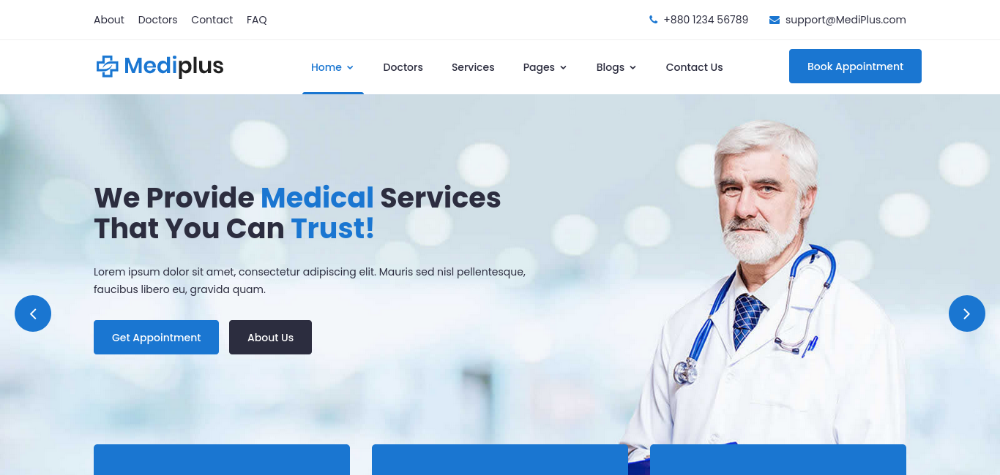
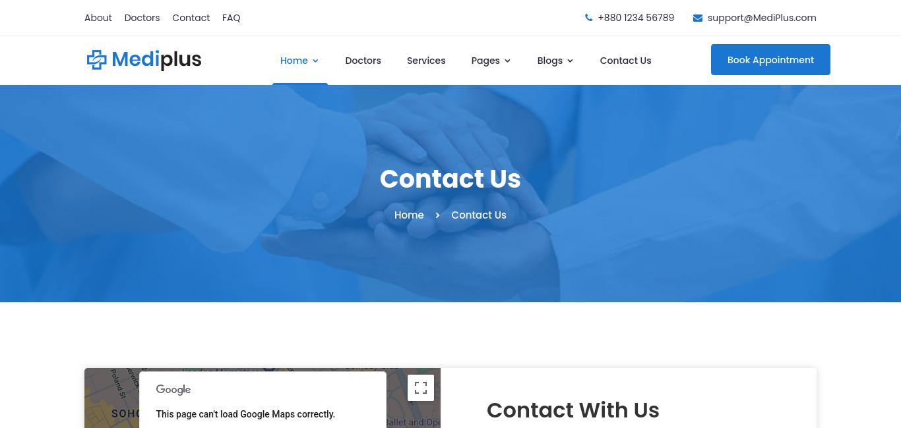

# Deploying Static Website using Load Balancer by ARM Template

## Project Overview

**MediPlus** is a website dedicated to beauty and makeup products. It allows users to explore a range of sustainable and inclusive makeup collections. The site aims to simplify the shopping experience by providing a user-friendly interface that highlights quality, sustainability, and customer satisfaction.

This project demonstrates the deployment of **MediPlus** using Azure's ARM templates and load balancing across two Virtual Machines (VMs) in different availability zones for high availability and scalability.

## Problem Statement

Choosing the right healthcare products can be overwhelming with the vast number of options available. MediPlus solves this problem by offering a curated selection of healthcare products that are reliable, sustainable, and of the highest quality. After building the website, the challenge was to deploy it on Azure using a load-balanced architecture for efficient traffic distribution.

## Project Goals

- Deploy the **MediPlus** website on Azure using ARM templates.
- Set up a **Virtual Network (VNet)** with two **Subnets** and a **Network Security Group (NSG)**.
- Use a **Load Balancer** to distribute traffic between two VMs located in different availability zones.
- Host the static website on these VMs and make it accessible via the load balancer's frontend IP.

## Technologies and Azure Services Used

1. **Azure CLI**: Used to create the resource group and Virtual Network.
2. **ARM Templates**: Automated the creation of VNet, subnets, and NSG.
3. **Azure Virtual Machines (VMs)**: Hosted the MediPlus website.
4. **Azure Load Balancer**: Distributed the traffic between two VMs to ensure high availability.
5. **Nginx**: Used as a web server on both VMs to serve the static content.
6. **Git**: Cloned the website from GitHub onto the VMs using a custom script.
7. **Custom Script Extension**: Used to automatically configure the VMs upon deployment.

## Project Steps

### 1. Website Development

- **MediPlus**: A static website dedicated to showcasing a curated selection of trusted and high-quality healthcare services.

### 2. Deploying the Website on GitHub

- The frontend of **MediPlus** was uploaded to a public GitHub repository: [Frontend-MediPlus](https://github.com/typicalcoder047/azuremagicbusproject.git).

### 3. Azure Deployment Using ARM Templates

- **Resource Group**: Created using Azure CLI to hold all the resources.
- **Virtual Network (VNet)**: Set up using an ARM template, which included two subnets for distributing the VMs.
- **Network Security Group (NSG)**: Applied inbound rules to allow traffic on ports 22 (SSH) and 80 (HTTP).

### 4. Virtual Machines Setup

- **VM 1**: Created in Availability Zone 1 using Azure Portal. Configured with:

  - Custom Script Extension to clone the website from GitHub.
  - Networking settings to connect to the VNet and assigned Subnet.

  Custom Script:

  ```bash
  #!/bin/bash
  sudo apt update
  sudo apt install nginx git -y
  cd /tmp && git clone https://github.com/typicalcoder047/azuremagicbusproject.git
  sudo rm -rf /var/www/html/index.nginx-debian.html
  sudo cp -r /tmp/mysite/* /var/www/html/
  ```

- **VM 2**: Created in Availability Zone 2 with the same configuration as VM 1.

### 5. Load Balancer Configuration

- **Load Balancer**: Configured to distribute traffic between VM 1 and VM 2.
  - **Frontend IP Configuration**: Assigned a new frontend IP for external access.
  - **Backend Pool**: Added both VMs to the backend pool for traffic distribution.
  - **Load Balancing Rule**: Defined to balance HTTP traffic (port 80) across the VMs.
  - **Health Probe**: Set up to monitor the health of the VMs and ensure traffic is routed only to healthy VMs.

### 6. Testing and Accessing the Website

- After the load balancer deployment, the website became accessible via the frontend IP of the load balancer. Users can interact with **MediPlus** to explore Healthcare services.

## How to Use MediPlus

1. Browse the Home page for information.
2. Read detailed information on your required topic.
3. Choose your desired healthcare service.

## Azure Services and Tools Used

- **Azure CLI**: Resource group creation and management.
- **Azure Resource Manager (ARM) Templates**: Infrastructure-as-Code to deploy resources.
- **Virtual Network (VNet)**: Networking and subnetting.
- **Network Security Group (NSG)**: Security rules for VM access.
- **Azure Virtual Machines**: Hosting the website on multiple VMs.
- **Azure Load Balancer**: Load balancing between VMs.
- **Nginx**: Web server for hosting static content.
- **Git**: Version control and cloning the website onto VMs.
- **Custom Script Extension**: Automated configuration of VMs.

## Live Website and Resources

- **Website Link**: [MediPlus](https://github.com/typical-pentester/Azure-MagicBus-Project)
- **Demo Video**: [video link ](https://drive.google.com/file/d/11Q-mJsoEwPNA-NsrP8FwVMfpvXQ_p_H7/view?usp=drive_link)
- **Screenshots**:
  **Created Resource Group Screenshot**

  - 

  **Website Home Page Screenshot**

  - 

  **Error Page after complete Deployment**

  - 

  **Contact Us Page after complete Deployment**

  - 

  **Blogs Page after complete Deployment**

  - 

## Conclusion

This project showcases the end-to-end process of deploying a static website using Azure's ARM templates and load balancing capabilities. By distributing traffic between two VMs in different availability zones, we ensure high availability and scalability for the **MediPlus** platform. The integration of Azure's powerful tools and services simplified the deployment and configuration process.

## Authors

**Mohammad Abdullah Shareef, GMSSPR Surya Abhay, Mohmmad Muzammil, Moghal Feroz Baig**  
Welcome to **MediPlus**! We're passionate about healthcare and dedicated to offering quality, sustainable healthcare services. Our focus is on customer satisfaction, transparency, and excellent support. Thank you for choosing **MediPlus**!
